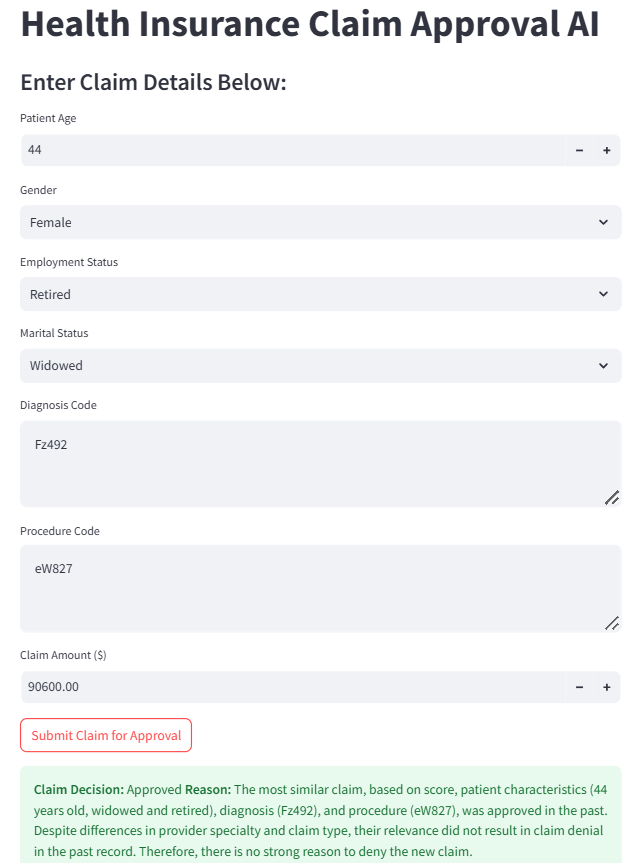

# 🏥 AI-Powered Health Insurance Claim Approval System

## 📌 Project Overview
This project leverages **GPT-4, FAISS, and FastAPI** to **automate health insurance claim approvals**. The system retrieves **past similar claims**, analyzes them, and generates **automated approval or denial decisions** with reasoning.

## 🚀 Features
✅ **AI-Powered Claim Processing** – Uses GPT-4 for approval decisions.  
✅ **Retrieval-Augmented Generation (RAG)** – Ensures decisions are backed by past claim data.  
✅ **FAISS Vector Search** – Retrieves **top similar past claims** for analysis.  
✅ **Interactive Frontend (Streamlit)** – Allows users to submit and review claims.  
✅ **Bias Detection & Override** – Ensures fair claim evaluations.  

---

## 🛠️ Tech Stack
| Component         | Technology Used |
|------------------|----------------|
| **Backend API** | FastAPI |
| **Claim Retrieval** | FAISS (Facebook AI Similarity Search) |
| **LLM Processing** | OpenAI GPT-4 (or Mistral-7B) |
| **Vector Embeddings** | Sentence Transformers (`all-MiniLM-L6-v2`) |
| **Frontend UI** | Streamlit |
| **Database** | CSV File (`Kaggle dataset health_claims.csv`) |
| **Deployment** | Local (Can be deployed on Hugging Face / Cloud) |

---

## 📂 Folder Structure
```
ai-claim-approval/ 
│── app/ # Backend API logic 
│ ├── init.py # Makes app a package 
│ ├── main.py # FastAPI app logic 
│ ├── claim_model.py # FAISS retrieval & GPT processing 
│ ├── config.py # API keys & configuration 
│ ├── utils.py # Helper functions 
│ │── models/ # Stores FAISS index & embeddings 
│ │ ├── claims_faiss.index # FAISS vector index 
│ │ ├── embeddings.npy # Saved claim embeddings 
│ │── data/ # Dataset 
│ │ ├── health_claims.csv # Health insurance dataset 
│── build_faiss_index.py # Store FAISS indices
│── requirements.txt # Dependencies 
│── Dockerfile # Deployment instructions 
│── frontend.py # Streamlit frontend 
│── README.md # Project documentation 
│── .gitignore # Ignore unnecessary files
```
---

## 🏗️ How It Works
### **🚀 Step 1: Data Preprocessing**
1. **Load health insurance claims dataset**  
2. **Convert claims into embeddings** using `sentence-transformers`  
3. **Store embeddings in FAISS for fast retrieval**  

### **🚀 Step 2: Backend API (FastAPI)**
1. **User submits a new insurance claim** through API  
2. **FAISS retrieves the top 3 most similar past claims**  
3. **GPT-4 (or another LLM) analyzes past cases and makes a decision**  
4. **API returns an "Approved" or "Denied" decision** with reasoning  

### **🚀 Step 3: Frontend UI (Streamlit)**
1. **User enters claim details** (Age, Diagnosis, Procedure, etc.)  
2. **Streamlit sends claim to FastAPI backend**  
3. **Backend retrieves past claims and gets GPT-4’s decision**  
4. **Decision is displayed on the UI** with past case references  

---

## 🔧 Installation & Setup (Run Locally)
### **1️⃣ Install Dependencies**
```bash
pip install fastapi uvicorn openai sentence-transformers faiss-cpu pandas numpy streamlit
```

### **2️⃣ Run Backend (FastAPI)**
```bash
uvicorn app.main:app --host 127.0.0.1 --port 8000 --reload
```
✅ **API will be live at** http://127.0.0.1:8000/docs

### **3️⃣ Run Frontend (Streamlit)**
```bash
streamlit run frontend.py
```
✅ **UI will be available at** http://localhost:8501

---

## **🚀 How the UI Output would look like:**

